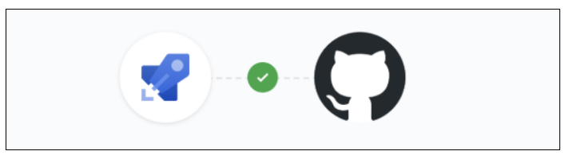
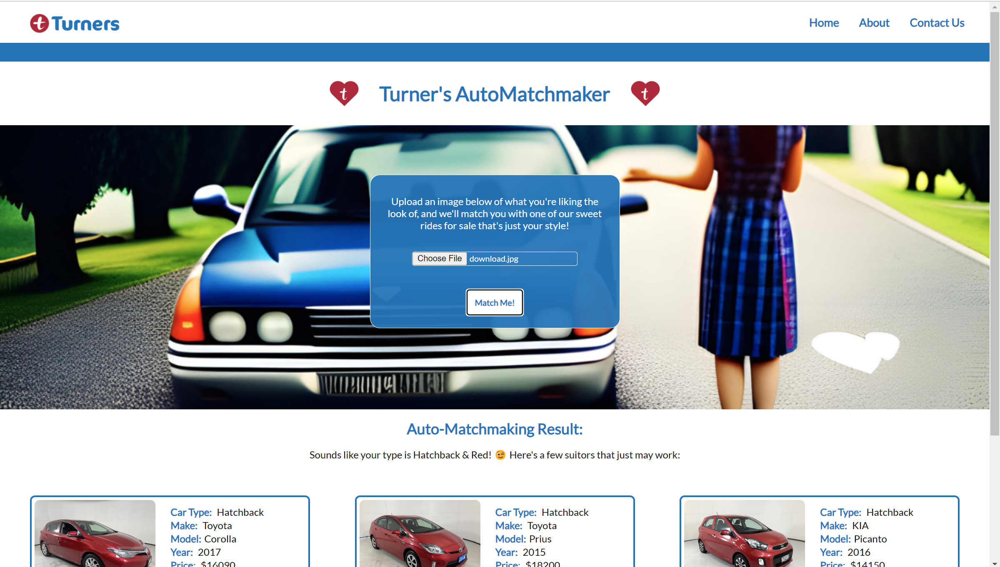

<a name="readme-top"></a>

<!-- PROJECT SHIELDS -->

[![Contributors][contributors-shield]][contributors-url]
Luis Rodríguez - [![GitHub - Luis Rodríguez][Github.logo]][luis-github-url]
Kelsie Smith - [![GitHub - Kelsie Smith][Github.logo]][kelsie-github-url]

<!-- PROJECT LOGO -->
<br />
<div align="center">
  <a href="https://github.com/KelsieSmitty/L5M3">
  
  </a>

<h3 align="center">DevOps Pipeline</h3>

  <p align="center">
   In this project, we built a pipeline that deploys a Node.js API to a cloud automatically. The pipeline is set up using GitHub Actions. As soon as you "git push" a new version of the code to your GitHub repository, the updated code is automatically deployed to Microsoft Azure. This ensures that your new version of the API becomes available in the cloud. Additionally, we have automated the process of running unit tests as part of the pipeline.
    <br />
    <a href="https://github.com/KelsieSmitty/L5M3"><strong>Explore the docs »</strong></a>

  </p>
</div>

<!-- TABLE OF CONTENTS -->
<details>
  <summary>Table of Contents</summary>
  <ol>
    <li>
      <a href="#about-the-project">About The Project</a>
      <ul>
        <li><a href="#built-with">Built With</a></li>
      </ul>
    </li>
    <li>
      <a href="#getting-started">Getting Started</a>
      <ul>
        <li><a href="#prerequisites">Prerequisites</a></li>
        <li><a href="#installation">Installation</a></li>
      </ul>
    </li>
    <li><a href="#usage">Usage</a></li>
    <li><a href="#contact">Contact</a></li>
    <li><a href="#acknowledgments">Acknowledgments</a></li>
  </ol>
</details>

<!-- ABOUT THE PROJECT -->

## About The Project

<!--  -->

<p align="right">(<a href="#readme-top">back to top</a>)</p>

### Built With

- [![Azure][Azure.logo]][Azure.logo]
- [![Node.js][Node.js.logo]][Nodejs-url]


<p align="right">(<a href="#readme-top">back to top</a>)</p>

<!-- GETTING STARTED -->

## Getting Started

### Prerequisites

To use the automated pipeline, follow these steps:

- Ensure that Node.js and npm are installed on your machine.
- Have an active Microsoft Azure account.

### GitHub Actions Setup

1. Fork or clone this repository into your GitHub account.
2. Set up your Azure credentials and necessary configurations as secrets in your GitHub repository settings.
3. Modify the GitHub Actions workflow file (`/.github/workflows/main.yml`) to configure the deployment and testing process according to your needs.


### Installation

1. Require the API Key with permission from luis@missionreadyhq.com
2. Clone the repo
   ```sh
   git clone https://github.com/KelsieSmitty/L5M3
   ```
3. Install NPM packages (as per above list)
   ```sh
   npm install
   ```
4. Enter your API Key, Endpoint, Headers and Port in `.env`
5. Open backend folder in terminal and run start script
   ```sh
   npm run start
   ```

<p align="right">(<a href="#readme-top">back to top</a>)</p>

<!-- USAGE EXAMPLES -->

## Usage

In this section, we'll guide you through the steps of using the automated deployment pipeline to ensure seamless deployment of your Node.js API on Microsoft Azure. Below is a breakdown of the process:

1. **Push Code Changes**: Update your Node.js API code according to your requirements.

2. **Commit and Push**: Commit your code changes using Git and push them to your GitHub repository. This can be achieved with the following commands:

   ```shell
   git add .
   git commit -m "Updated API code"
   git push origin main


_For more examples, please refer to the [Documentation](https://example.com)_

<p align="right">(<a href="#readme-top">back to top</a>)</p>

<!-- CONTACT -->

## Contact

Luis Rodríguez - luis@missionreadyhq.com
<br></br><br></br>
Kelsie Smith - kelsieS@missionreadyhq.com

- [![LinkedIn - Kelsie Smith][linkedin-shield]][kelsie-linkedin-url]
  <br></br>
  <br></br>
  Project Link: [https://github.com/KelsieSmitty/L5M3](https://github.com/WeisshorNz/L5-Mission2)

<p align="right">(<a href="#readme-top">back to top</a>)</p>

<!-- ACKNOWLEDGMENTS -->

## Acknowledgments

- [Best README Template](https://github.com/othneildrew/Best-README-Template/tree/master)
- [GitHub Actions](https://docs.github.com/en/actions)
- [Azure CLI Documentation](https://learn.microsoft.com/en-us/cli/azure/)
- [Microsoft Azure](https://learn.microsoft.com/en-us/azure/?product=popular)
- [Node.js Deployment Best Practices](https://expressjs.com/en/advanced/best-practice-performance.html)


<p align="right">(<a href="#readme-top">back to top</a>)</p>

<!-- MARKDOWN LINKS & IMAGES -->

[contributors-shield]: https://img.shields.io/github/contributors/WeisshorNz/L5-Mission2.svg?style=for-the-badge
[contributors-url]: https://github.com/WeisshorNz/L5-Mission2/graphs/contributors
[linkedin-shield]: https://img.shields.io/badge/-LinkedIn-black.svg?style=for-the-badge&logo=linkedin&colorB=555
[Github.logo]: https://img.shields.io/badge/GitHub-100000?style=for-the-badge&logo=github&logoColor=white
[luis-github-url]: https://github.com/WeisshorNz
[kelsie-github-url]: https://github.com/KelsieSmitty
[kelsie-linkedin-url]: https://www.linkedin.com/in/kelsieSmitty/
[product-screenshot]: images/screenshot.png
[React.js]: https://img.shields.io/badge/React-20232A?style=for-the-badge&logo=react&logoColor=61DAFB
[React-url]: https://reactjs.org/
[Nodejs-url]: https://nodejs.org/en
[Node.js.logo]: https://img.shields.io/badge/Node.js-43853D?style=for-the-badge&logo=node.js&logoColor=white
[Azure-url]:https://azure.microsoft.com/en-us
[Azure.logo]:https://img.shields.io/badge/Azure-0078D4?style=for-the-badge&logo=microsoftazure&logoColor=white